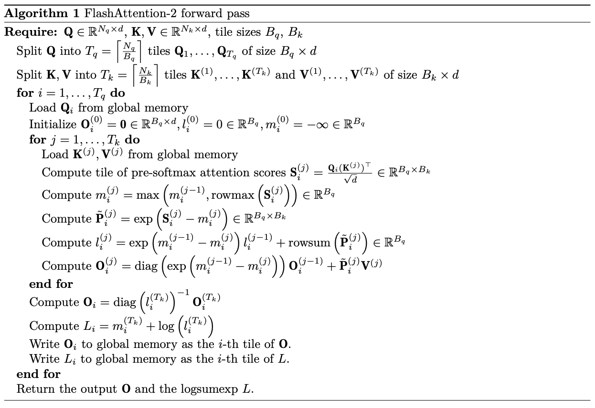

# Systems Basics
## Profiling and Benchmarking
### Model size
Measure first, then optimize.
1. Python standard library to time forward and backward pass.
2. Profile compute with the NVIDIA Nsight Systems tool.
3. Profile memory usage.

Fix vocab size to 10000, batch size to 4.
| Size   | d_model | d_ff  | num_layers | num_heads |
|--------|---------|-------|------------|-----------|
| small  | 768     | 3072  | 12         | 12        |
| medium | 1024    | 4096  | 24         | 16        |
| large  | 1280    | 5120  | 36         | 20        |
| xl     | 1600    | 6400  | 48         | 25        |
| 2.7B   | 2560    | 10240 | 32         | 32        |

### End-to-End Benchmarking: `timeit`
#### Results
**Forward only (warmup = 5, context_length=128)**
| size   |   params (M) | forward_only   |   mean_ms |   stdev_ms |
|:-------|-------------:|:---------------|----------:|-----------:|
| small  |      128.625 | True           |     26.83 |       0.65 |
| medium |      423.183 | True           |     78.64 |       0.22 |
| large  |      969.412 | True           |    170.47 |       0.18 |
| xl     |      1998.24 | True           |    328.06 |       1.18 |
| 2.7B   |      3406.81 | True           |    514.75 |       1.39 |


**Forward and Backward (warmup = 5, context_length=128)**
| size   |   params (M) | forward_only   |   mean_ms |   stdev_ms |
|:-------|-------------:|:---------------|----------:|-----------:|
| small  |      128.625 | False          |     83.07 |       1.28 |
| medium |      423.183 | False          |    247.43 |       0.44 |
| large  |      969.412 | False          |    525.73 |        0.7 |
| xl     |      1998.24 | False          |   1024.57 |       2.11 |

**Forward only (warmup = 0, fcontext_length=128)**
| size   |   params (M) | forward_only   |   mean_ms |   stdev_ms |
|:-------|-------------:|:---------------|----------:|-----------:|
| small  |      128.625 | True           |     47.45 |      65.44 |
| medium |      423.183 | True           |     98.01 |      60.52 |
| large  |      969.412 | True           |     190.5 |         66 |
| xl     |      1998.24 | True           |     348.5 |      63.21 |
| 2.7B   |      3406.81 | True           |    533.85 |      62.11 |

#### Analysis
**Forward Pass Latency**: Scales roughly linearly with model size, from 26.83ms (small) to 514.75ms (2.7B).
**Backward Pass Latency**: Backward pass takes approximately 3× longer than the forward pass. This matches theoretical expectations — the backward pass must recompute gradients through every layer, requiring roughly 2× the work of the forward pass, totaling ~3× end-to-end.
**Variability**: Standard deviation is consistently below 2ms across all configurations, representing less than 1% of the mean. Measurements are highly stable, confirming that the warm-up steps successfully eliminated initialization noise.

**Effect of Warm-up Steps**
Without warm-up, the mean is slightly higher and the standard deviation explodes. The first few steps are dramatically slower than the rest.

**The first forward pass is always slow** because:
- CUDA kernel compilation — PyTorch compiles and caches CUDA kernels on first use. This one-time cost inflates the first measurement significantly.
- Memory allocation — GPU memory for activations and weights is allocated and paged in on the first run, adding overhead that disappears in subsequent steps.
- CPU/GPU cache cold start — Caches are empty on the first pass; subsequent passes benefit from warm caches.

**1-2 warm-up steps may not be enough** because:
- CUDA kernel compilation can span multiple steps — some kernels are only triggered in specific layers, so a single pass may not compile all of them.
- Memory allocator behavior — PyTorch's caching allocator may still be adjusting its allocation strategy after just 1-2 passes.
- CPU-side JIT overhead — Python-level overhead (e.g., autograd graph construction) also takes a few steps to stabilize.

A safe default is 5+ warm-up steps to ensure all one-time costs are fully absorbed before timing begins.

### Nsight Systems Profiler
`nsys` can do running time analysis for functions and CUDA kernels which are executed asynchronously on the GPU. For use, just add `nsys profile -o result`:
`uv run nsys profile -o result python benchmark.py`
It will write outputs to `result.nsys.rep`.

We can then view the profile on your local machine with the *NVIDIA Nsight Systems desktop application*. Selecting a particular CUDA API call (on the CPU) in the CUDA API row of the profile will highlight all corresponding kernel executions (on the GPU) in the CUDA HW row. Possible usages are:
1. Get Python backtraces for each CUDA API call with `--python-backtrace=cuda`, may introduce overhead.
2. NVTX (NVIDIA Tools Extension): Annotate a range of codes, thus in visualization, they will appear as blocks in the NVTX row. (Ignore warmup steps)
- It could isolate kernels for different parts:
    ```python
    import torch.cuda.nvtx as nvtx

    @nvtx.range("scaled dot product attention")
    def annotated_scaled_dot_product_attention(... # Q, K, V, mask)
        ...
        with nvtx.range("computing attention scores"):
            ... # compute attention scores between Q and K
        with nvtx.range("computing softmax")
            ... # compute softmax of attention scores
        with nvtx.range("final matmul")
            ... # compute output projection
        return ...
    ```
    - Decorater: `@nvtx.range("...")`
    - Context Manager: `with nvtx.range("..."):`
- `cs336_basics.model.scaled_dot_product_attention = annotated_scaled_dot_product_attention` swap the implementation with annotated version.
  - No need to adjust source code.
- `--pytorch` command-line option with `nsys` to annotate calls to PyTorch C++ API to do lower level analysis.

#### Steps
Run on clusters with:
`uv run nsys profile -o profiles/small_128 --pytorch python nsys_profiler.py --size small --context_length 128`
On local terminal:
`scp username@login-ice.pace.gatech.edu:~/path/to/profiles/small_128.nsys-rep ~/LocalDocuments/Courses/CS336_LLM_from_scratch/assignment2-systems/profiles`
Then open the file in *NVIDIA Nsight Systems desktop application*.

#### Results (TODO)

#### Analysis (TODO)

### Mixed Precision
Earlier `torch.float32` is used. But at tensor cores (NVIDIA DPUs) can achieve >16$\times$ performance with FP16 or BF16.
1. To overcome Underflow, use **loss scaling**: the loss is simply multiplied by a scaling factor, increasing gradient magnitudes so they don’t flush to zero. The result will be divided by the factor before update.
2. For Overflow (NaN), use bfloat16 (same dynamic range as FP32).

Mixed Precision: `torch.autocast` context manager. It automatically identify which operations to perform in lower-precision.

#### `mixed_precision_accumulation`
- The FP32 accumulator (case 1) gives the most accurate result of 10.0001, very close to the true value of 10.0.
- Pure FP16 accumulation (case 2) is the least accurate at 9.9531, because FP16 has limited precision and rounding errors compound over 1000 additions.
- Interestingly, cases 3 and 4 both yield 10.0021 — whether you accumulate FP16 values directly into a FP32 accumulator or explicitly cast each value to FP32 first, the result is the same and significantly better than pure FP16, which demonstrates why mixed precision keeps accumulators in FP32 even when the operands are in lower precision.

**Keep accumulations in higher precision even if the tensors themselves being accumulated have been downcasted.**

#### Data types under FP16 Autocast
| Component | Data Type |
|-----------|-----------|
| Model parameters (stored) | `torch.float32` |
| Output of `fc1` (Linear) | `torch.float16` |
| Output of `ln` (LayerNorm) | `torch.float32` |
| Predicted logits (output of `fc2`) | `torch.float16` |
| Loss | `torch.float32` |
| Gradients | `torch.float32` |

- Matrix multiplications (Linear layers) -> FP16
- LayerNorm -> FP32.
- Parameters are never modified in storage — only temporarily cast during computation.
- Gradients and loss are always accumulated in FP32 regardless of the autocast dtype.

**Why layernorm treated differently**
LayerNorm internally computes the mean and variance of its inputs,
$$\mu = \frac{1}{d} \sum_{i=1}^{d} x_i,\quad \sigma^2 = \frac{1}{d} \sum_{i=1}^{d} (x_i - \mu)^2,\quad \hat{x}_i = \frac{x_i - \mu}{\sqrt{\sigma^2 + \epsilon}}$$both of which are **summation-based reductions**.
If switched from FP16 to BF16, the dynamic range issue (overflow/underflow) is resolved, but reduction accuracy remains a concern.
In practice, PyTorch's autocast keeps LayerNorm in FP32 for both FP16 and BF16 to avoid this precision loss.

#### Results and Analysis (TODO)


### Profiling Memory
PyTorch has a powerful memory profiler which can keep track of allocations over time. To use:
```python
... # warm-up phase in your benchmarking script
# Start recording memory history.
torch.cuda.memory._record_memory_history(max_entries=1000000)
... # what you want to profile in your benchmarking script
# Save a pickle file to be loaded by PyTorch's online tool.
torch.cuda.memory._dump_snapshot("memory_snapshot.pickle")
# Stop recording history.
torch.cuda.memory._record_memory_history(enabled=None)
```
1. Download `memory_snapshot.pickle`.
2. visit https://pytorch.org/memory_viz.
3. Drag pickle to it.

---

## FlashAttention-2
**Problem**
Standard attention computes:
$$\text{Attention}(Q,K,V) = \text{softmax}\left(\frac{Q^\top K}{\sqrt{d_k}}\right)V$$Memory cost:
```
seq_len × seq_len × batch_size × num_heads × bytes_per_element
```
For long sequences (e.g., 4096, 8192 tokens), this matrix becomes **enormous**, causing out-of-memory (OOM) errors.
**Solution**
FlashAttention-2 computes attention **by tiles** — splitting Q, K, V into small blocks and processing them one block at a time, never storing the full `seq_len × seq_len` matrix.

| Property | Standard Attention | FlashAttention-2 |
|----------|--------------------|-----------------|
| Peak memory | O(seq_len²) | O(seq_len) |
| OOM on long sequences | Yes | No |
| Numerical result | Exact | **Identical**|
| Speed | Baseline | Faster (better memory access patterns) |

- The speedup and memory savings come purely from a smarter execution order that avoids unnecessary reads and writes to slow HBM (high-bandwidth memory).

### PyTorch Attention

#### Results and Analysis (TODO)

### JIT-Compiled Attention
Just-In-Time compiler works at the first runtime. it automatically generate fused Triton kernels by dynamically analyzing your computation graph.


### Triton
Write more specific optimized GPU kernel using python

1. Triton decomposes computation into **Program Instances**. Each instance represents a block of threads running in parallel on the GPU. Work is distributed using a Program ID (pid); for example, instance i is responsible for processing the i-th tile of data.
2. Triton processes data in small, rectangular sub-sections called **Tiles**.
   - Pointers and Strides: Triton accesses memory using the base pointer of a tensor and strides (which define the memory jump required to move along specific axes).
   - `tl.make_block_ptr`: It creates a "virtual window" over a global tensor by defining its shape, strides, and the desired tile size.
3. `.advance`: Once a block pointer is initialized, you can navigate the tensor grid using the `.advance` method. As shown in the tiling schematics:
   - `.advance((ROWS_TILE, 0))` shifts the window down to the next set of rows.
   - `.advance((0, D_TILE))` shifts the window to the right to process the next segment of features.
4. Explicit Memory Management (Load/Store)
    - `tl.load`: You must manually pull data from High Bandwidth Memory (HBM) into fast on-chip SRAM before performing calculations.
    - `tl.store`: After the computation, the result must be explicitly written back from SRAM to the designated memory address in the output tensor.

#### weighted_sum_fwd
**Forward pass**
```python
import triton
import triton.language as tl
@triton.jit
def weighted_sum_fwd(
    x_ptr, weight_ptr, # input pointer
    output_ptr, # outputpoint
    x_stride_row, x_stride_dim, # Strides tell us how to move one element in each axis of a tensor
    weight_stride_dim, # Likely 1
    output_stride_row, # Likely 1
    ROWS, D,
    ROWS_TILE_SIZE: tl.constexpr, D_TILE_SIZE: tl.constexpr, # Tile shapes must be known at compile time
):
    # `tl.program_id` check which thread block we're running in
    row_tile_idx = tl.program_id(0)

    x_block_ptr = tl.make_block_ptr(
        x_ptr,
        shape=(ROWS, D),
        strides=(x_stride_row, x_stride_dim),
        offsets=(row_tile_idx * ROWS_TILE_SIZE, 0),
        block_shape=(ROWS_TILE_SIZE, D_TILE_SIZE),
        order=(1, 0), # Order of the dimensions in memory from major to minor
    )
    weight_block_ptr = tl.make_block_ptr(
        weight_ptr,
        shape=(D,),
        strides=(weight_stride_dim,),  # likely 1
        offsets=(0,),
        block_shape=(D_TILE_SIZE,),
        order=(0,),
    )
    output_block_ptr = tl.make_block_ptr(
        output_ptr,
        shape=(ROWS,),
        strides=(output_stride_row,),  # likely 1
        offsets=(row_tile_idx * ROWS_TILE_SIZE,),
        block_shape=(ROWS_TILE_SIZE,),
        order=(0,),
    )
    # Initialize a buffer to write to
    output = tl.zeros((ROWS_TILE_SIZE,), dtype=tl.float32)

    for i in range(tl.cdiv(D, D_TILE_SIZE)):
        row = tl.load(x_block_ptr, boundary_check=(0, 1), padding_option="zero")
        weight = tl.load(weight_block_ptr, boundary_check=(0,), padding_option="zero")
        output += tl.sum(row * weight[None, :], axis=1)
        x_block_ptr = x_block_ptr.advance((0, D_TILE_SIZE))
        weight_block_ptr = weight_block_ptr.advance((D_TILE_SIZE,))

    tl.store(output_block_ptr, output, boundary_check=(0,))
```
To wrap it up in PyTorch Autograd function:
- `torch.autograd.Function` can self-define forward and backward，and connect to autograd. `ctx` is a context manager to pass information between forward and backward.
```python
class WeightedSumFunc(torch.autograd.Function):
    @staticmethod
    def forward(ctx, x, weight):
        D, output_dims = x.shape[-1], x.shape[:-1]
        input_shape = x.shape
        x = rearrange(x, "... d -> (...) d") # -> 2D

        ctx.save_for_backward(x, weight)

        assert len(weight.shape) == 1 and weight.shape[0] == D, "Dimension mismatch"
        assert x.is_cuda and weight.is_cuda, "Expected CUDA tensors"
        assert x.is_contiguous(), "Our pointer arithmetic will assume contiguous x"

        ctx.D_TILE_SIZE = triton.next_power_of_2(D) // 16
        ctx.ROWS_TILE_SIZE = 16 # store in ctx to reuse in backward
        ctx.input_shape = input_shape

        y = torch.empty(output_dims, device=x.device) # faster than torch.zeros
        n_rows = y.numel()

        weighted_sum_fwd[(cdiv(n_rows, ctx.ROWS_TILE_SIZE),)](
            # Lauch grid: show num of program instances to start
            x, weight,
            y,
            x.stride(0), x.stride(1),
            weight.stride(0),
            y.stride(0),
            ROWS=n_rows, D=D,
            ROWS_TILE_SIZE=ctx.ROWS_TILE_SIZE,
            D_TILE_SIZE=ctx.D_TILE_SIZE,
        )
        return y.view(input_shape[:-1])
```

**Backward pass**

$$(\nabla_x \mathcal{L})_{ij} = \sum_{k=1}^{n} \frac{\partial f(x,w)_k}{\partial x_{ij}} (\nabla_{f(x,w)}\mathcal{L})_k=w_j\cdot (\nabla_{f(x, w)}\mathcal{L})_i$$$$\Rightarrow \nabla_x\mathcal{L}=\nabla_{f(x, w)}\mathcal{L}\otimes w\quad \text{(Outer Product)}$$

$$(\nabla_w \mathcal{L})_j = \sum_{i=1}^{n} \frac{\partial f(x,w)_i}{\partial w_j} (\nabla_{f(x,w)}\mathcal{L})_i= \sum_{i=1}^{n} x_{ij} \cdot (\nabla_{f(x,w)}\mathcal{L})_i$$

```python
@triton.jit
def weighted_sum_backward(
    x_ptr, weight_ptr, # input
    grad_output_ptr,  #grad input [NUM_ROWS]
    grad_x_ptr, partial_grad_weight_ptr,  # Outputs：∇x and partial ∇w
    stride_xr, stride_xd,
    stride_wd,
    stride_gr,
    stride_gxr, stride_gxd,
    stride_gwb, stride_gwd,
    NUM_ROWS, D,
    ROWS_TILE_SIZE: tl.constexpr,
    D_TILE_SIZE: tl.constexpr,
):
    row_tile_idx = tl.program_id(0)
    n_row_tiles  = tl.num_programs(0)

    grad_output_block_ptr = tl.make_block_ptr(
        grad_output_ptr,
        shape=(NUM_ROWS,), strides=(stride_gr,),
        offsets=(row_tile_idx * ROWS_TILE_SIZE,),
        block_shape=(ROWS_TILE_SIZE,),
        order=(0,),
    )

    x_block_ptr = tl.make_block_ptr(
        x_ptr,
        shape=(NUM_ROWS, D), strides=(stride_xr, stride_xd),
        offsets=(row_tile_idx * ROWS_TILE_SIZE, 0),
        block_shape=(ROWS_TILE_SIZE, D_TILE_SIZE),
        order=(1, 0),
    )

    weight_block_ptr = tl.make_block_ptr(
        weight_ptr,
        shape=(D,), strides=(stride_wd,),
        offsets=(0,),
        block_shape=(D_TILE_SIZE,),
        order=(0,),
    )

    grad_x_block_ptr = tl.make_block_ptr(
        grad_x_ptr,
        shape=(NUM_ROWS, D), strides=(stride_gxr, stride_gxd),
        offsets=(row_tile_idx * ROWS_TILE_SIZE, 0),
        block_shape=(ROWS_TILE_SIZE, D_TILE_SIZE),
        order=(1, 0),
    )

    partial_grad_weight_block_ptr = tl.make_block_ptr(
        partial_grad_weight_ptr,
        shape=(n_row_tiles, D), strides=(stride_gwb, stride_gwd),
        offsets=(row_tile_idx, 0),
        block_shape=(1, D_TILE_SIZE),
        order=(1, 0),
    )

    for i in range(tl.cdiv(D, D_TILE_SIZE)):
        grad_output = tl.load(
            grad_output_block_ptr,
            boundary_check=(0,), padding_option="zero"
        )
        weight = tl.load(
            weight_block_ptr,
            boundary_check=(0,), padding_option="zero"
        )
        grad_x_row = grad_output[:, None] * weight[None, :]
        # [ROWS_TILE_SIZE, 1]*[1, D_TILE_SIZE]
        # => [ROWS_TILE_SIZE, D_TILE_SIZE]
        tl.store(grad_x_block_ptr, grad_x_row, boundary_check=(0, 1))

        row = tl.load(
            x_block_ptr,
            boundary_check=(0, 1), padding_option="zero"
        )  # [ROWS_TILE_SIZE, D_TILE_SIZE]
        grad_weight_row = tl.sum(row * grad_output[:, None], axis=0, keep_dims=True)
        tl.store(
            partial_grad_weight_block_ptr, grad_weight_row,
            boundary_check=(1,)   # dim 0 永远不越界（只有1行），只检查 dim 1
        )

        x_block_ptr                   = x_block_ptr.advance((0, D_TILE_SIZE))
        weight_block_ptr              = weight_block_ptr.advance((D_TILE_SIZE,))
        partial_grad_weight_block_ptr = partial_grad_weight_block_ptr.advance((0, D_TILE_SIZE))
        grad_x_block_ptr              = grad_x_block_ptr.advance((0, D_TILE_SIZE))
```

- $\nabla w$ cannot be reduced directly inside the kernel (race condition across instances), so each instance writes its partial row-sum to a separate row of partial_grad_weight [n_row_tiles, D], which is then collapsed to [D] outside the kernel via a single `partial_grad_weight.sum(dim=0)`.

```python
class WeightedSumFunc(torch.autograd.Function):
    @staticmethod
    def backward(ctx, grad_output):
        x, weight = ctx.saved_tensors
        ROWS_TILE_SIZE, D_TILE_SIZE = ctx.ROWS_TILE_SIZE, ctx.D_TILE_SIZE
        n_rows, D = x.shape

        grad_x = torch.empty_like(x)
        partial_grad_weight = torch.empty(
            (tl.cdiv(x.shape[0], ctx.ROWS_TILE_SIZE), x.shape[1]),
            device=x.device
        )

        # 启动 backward kernel
        weighted_sum_backward[(cdiv(n_rows, ROWS_TILE_SIZE),)](
            x, weight,
            grad_out,
            grad_x, partial_grad_weight,
            x.stride(0), x.stride(1),
            weight.stride(0),
            grad_out.stride(0),
            grad_x.stride(0), grad_x.stride(1),
            partial_grad_weight.stride(0), partial_grad_weight.stride(1),
            NUM_ROWS=n_rows, D=D,
            ROWS_TILE_SIZE=ROWS_TILE_SIZE,
            D_TILE_SIZE=D_TILE_SIZE,
        )
        grad_weight = partial_grad_weight.sum(dim=0)
        # [n_row_tiles, D] → [D]
        grad_x = grad_x.view(ctx.input_shape)

        return grad_x, grad_weight
```

Obtain a function like those implemented in `torch.nn.functional`: `f_weightedsum=WeightedSumFunc.apply`. Call it on $x$ and $w$ give tensor result:
`tensor([ 90.8563, -93.6815, -80.8884, ..., 103.4840],
    device='cuda:0', grad_fn=<WeightedSumFuncBackward>)`
PyTorch knows what to call in backward pass.


### FlashAttention-2 forward pass
$$\mathbf{S} = \mathbf{QK}^\top/\sqrt{d}; \quad \mathbf{P} = \text{softmax}(\mathbf{S}); \quad \mathbf{O} = \mathbf{PV}$$Backward needs $\mathbf{P}$, which causes large memory and IO costs.

The main goal is to avoid reading and writing the attention matrix to and from HBM, to reduce IO and peak memory costs. Three techniques:
1. **Tiling**: Split the input into tiles and make several passes over input tiles, thus incrementally performing the softmax reduction.
2. **Recomputation**: Save “activation checkpoints” in HBM, then recompute part of the forward pass to get other activations we need for computing gradients.
   - FlashAttention-2 stores the logsumexp of the attention scores, L: $$L_i=\log(\sum_j\exp(S_{ij}))$$
   - Compute this in an online manner.
3. Operator fusion: Performing all our operations in a single kernel to avoid repeated memory IO. Operator fusion is partly enabled by recomputation.

#### Backward pass with recomputation
- Since compute speed is faster than HBM IO, so recompute $P$.
- $L$ is calculated in the forward pass, and saved.
- $D$ (a vector) is calculated at the start of backward pass: $D=\text{row-sum}(O\circ dO)$.
  - $PdP^T = P(dOV^T)^T = PV(dO)^T = OdO^T$

With $L$ and $D$, backward pass can be computed without softmax.
$$\begin{align*}
    &D =\text{row-sum}(O\circ dO)\\
    \text{Reconstruct Attention}:\quad &
    S = QK^T / \sqrt{d};\; P_{ij} = \exp(S_{ij} - L_i)\\
    \text{Grads for }V:\quad &
    dV = P^T dO\\
    \text{Grads for softmax}:\quad &
    dS_{ij} = P_{ij} \circ (dP_{ij} - D_i)\\
    & \text{where}\quad dP = dO V^T\\
    \text{Grads for }Q,K:\quad &dQ = dSK / \sqrt{d};\quad dK = dS^T Q / \sqrt{d}
\end{align*}$$

> **If $O = PV$, then $dV = P^T dO$** and ($dP=dOV^T$)
> *Proof*: Write $O_{ik} = \sum_{j} P_{ij} V_{jk}$. Consider $V_{mn}$'s contribution to $O_{ik}$:$$dV_{mn} = \frac{\partial L}{\partial V_{mn}} = \sum_{i} \sum_{k} \frac{\partial L}{\partial O_{ik}} \frac{\partial O_{ik}}{\partial V_{mn}}$$Only when $j=m$ and $k=n$, partial derivative is not 0：$$\frac{\partial O_{ik}}{\partial V_{mn}} = P_{im} \quad (\text{when } k=n)$$$$\Rightarrow dV_{mn} = \sum_{i} dO_{in} \cdot P_{im}$$$$\Rightarrow dV_{mn} = \sum_{i} (P^T)_{mi} \cdot dO_{in}$$
> **Softmax gradient**
> For a score vector, $P_i = \frac{e^{S_i}}{\sum_j e^{S_j}}$. To compute $\frac{\partial P_i}{\partial S_j}$ with $\left(\frac{u}{v}\right)' = \frac{u'v - uv'}{v^2}$.
> If $i = j$, $\frac{\partial P_i}{\partial S_i} = \frac{e^{S_i} (\sum e^{S_k}) - e^{S_i} (e^{S_i})}{(\sum e^{S_k})^2} = \frac{e^{S_i}}{\sum e^{S_k}} - \left(\frac{e^{S_i}}{\sum e^{S_k}}\right)^2 = P_i - P_i^2 = P_i(1 - P_i)$
> If $i \neq j$, $\frac{\partial P_i}{\partial S_j} = \frac{0 \cdot (\sum e^{S_k}) - e^{S_i} (e^{S_j})}{(\sum e^{S_k})^2} = - \frac{e^{S_i}}{\sum e^{S_k}} \cdot \frac{e^{S_j}}{\sum e^{S_k}} = -P_i P_j$
> This can be written in a matrix: $J = \text{diag}(P) - P P^T$. Given $dP$, want $dS$: $$dS = J^T \cdot dP=J\cdot dP=(\text{diag}(P) - P P^T) dP$$$$\Rightarrow dS = \text{diag}(P) dP - (P P^T) dP= P \circ dP - P \cdot D = P \circ (dP - D)$$$$\Rightarrow dS_{ij} = P_{ij} \circ (dP_{ij} - D_i)$$


### Algorithm: FA2 forward pass
**Running Variables**: For each query tile $i$, we maintain across key tiles $j$:

| Variable | Shape | Meaning |
|----------|-------|---------|
| $m_i^{(j)}$ | $[B_q]$ | Running row-wise **maximum** of $S$ seen so far (for numerical stability) |
| $l_i^{(j)}$ | $[B_q]$ | Running **proxy for the softmax denominator** |
| $\mathbf{O}_i^{(j)}$ | $[B_q, d]$ | Running **unnormalized output** accumulator |

**Algorithm**


> $O_i = \frac{\sum_k \exp(S_{ik}) \cdot V_k}{\sum_k \exp(S_{ik})}$. Both **Numerator** $\tilde{O}$ and **Denominator** $l$ are accumulated tile by tile.
> **Final division** is done once at the end.

> If $m$ increases , all previously computed $\exp(S - m_\text{old})$ values should be multiply old results by $\exp(m_\text{old} - m_\text{new}) \leq 1$ to rescale them to the new baseline.
> New:  `exp(S - m_new) = exp(S - m_old) × exp(m_old - m_new)`
> This applies to **both** $l$ and $O$:
> - `l^(j) = exp(m_old - m_new) * l^(j-1) + rowsum(P̃^(j))`
> - `O^(j) = exp(m_old - m_new)[:, None] * O^(j-1) + P̃^(j) @ V^(j)`
